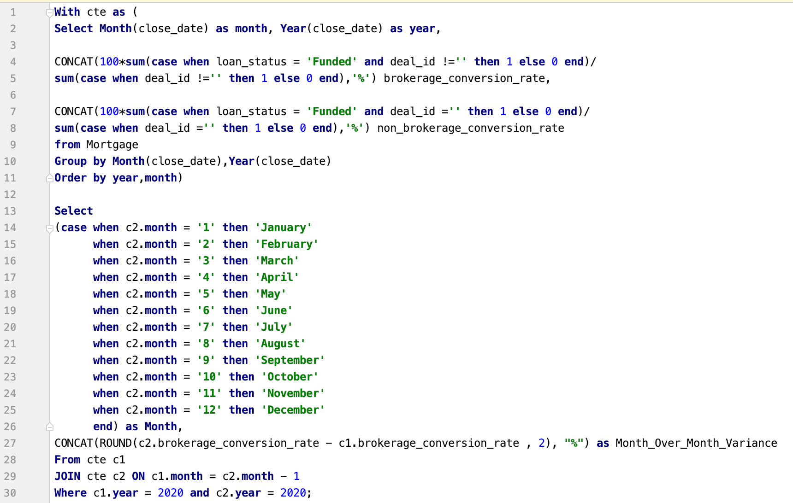

# Mortgage Data Analytics
This repository presents data insights/analytics for mortgage data from different lenders. This analysis is particularly based on loan application conversion rates.

### Metrics Used:
- **Conversion Rate** - Loan application conversion Rate, measures the percentage of loans applied for that are closed and funded by the lending institution. This KPI is an important measure of efficiency, potential wasted effort and overall customer service levels within the mortgage lending function.

- **Time Series Analysis** - Time series analysis comprises methods for analyzing time series data in order to extract meaningful statistics and other characteristics of the data

## SQL Analysis - Month over Month (MoM) Variance
##### MoM variance for Brokerage conversion rates in the year of 2020.

##### Output:

